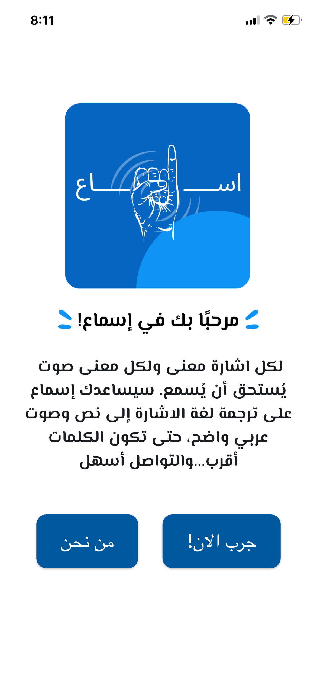
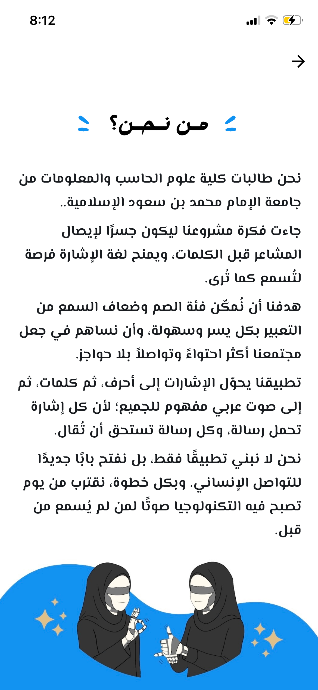
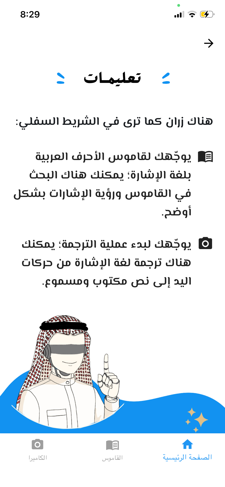
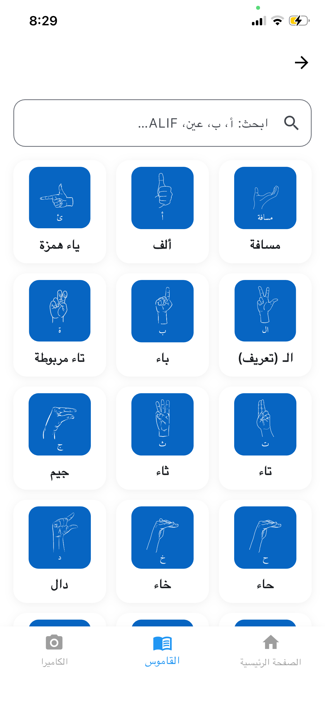
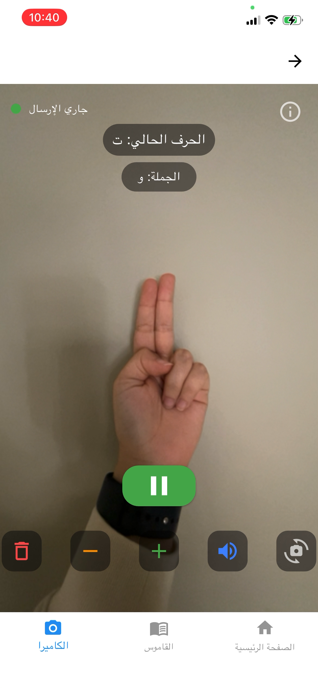

# Esma'a
Esma’a is a mobile application designed to bridge the communication gap between Deaf/Hard-of-Hearing individuals and hearing people. The app recognizes Arabic Sign Language (ArSL) hand gestures using advanced Computer Vision and Deep Learning, then converts them into clear Arabic text and spoken speech.
This system aims to make communication more accessible, inclusive, and instant for users.

## Features
- **Real-Time Sign Recognition:** Detects Arabic Sign Language gestures live using MediaPipe and a fine-tuned CNN model (EfficientNetB0).
- **Sign-to-Text Conversion:** Translates recognized gestures into Arabic characters and full sentences.
- **Text-to-Speech Output:** Uses Microsoft Edge-TTS to convert translated text into clear Arabic audio.
- **Cross-Platform Mobile App:** Built using Flutter for Android and iOS.

## Technologies Used
- **Flutter:** Mobile app development
- **FastAPI:** Backend server for recognition & TTS
- **EfficientNetB0:** Deep learning model for classification
- **MediaPipe:** hand tracking
- **OpenCV:** Image preprocessing
- **Microsoft Edge TTS:** Arabic text-to-speech
- **PyTorch / TorchVision:** Training and modeling

## System Workflow
- **Hand Detection:** MediaPipe detects the hand and extracts 21 landmarks.
- **Preprocessing:** Frames are resized, normalized, and cropped.
- **Gesture Classification:** EfficientNetB0 predicts the Arabic letter.
- **Sentence Building:** Users can add, delete, or clear letters to form sentences.
- **Speech Generation:** The final text is converted to Arabic audio using Edge-TTS.

## Screen Structure

### 1. Welcome Screen:
- Entry/intro and navigation to about us (من نحن) or try it now (!جرب الآن).

 

### 2. About us Screen:
- Team members and project purpose.

 

### 3. Home Screen:
- main page where you can navigate to dictionary and camera.

 

### 4. dictionary Screen:
- Displays all supported signs with search tap.

 

### 5. Camera Screen:
- Live camera feed and Real-time ArSL prediction with info icon.

 

  
  

## Demo:

## Future Plan:
- Support for full words & sentences
- Integration of facial expression recognition
- Offline speech synthesis
- Multi-language support

## Team member:
- wateen Ali Alrumayh
- Renad Majed Alrubaish
- Rahaf Raied Megdad
- Dina Hameed Alotaibi

